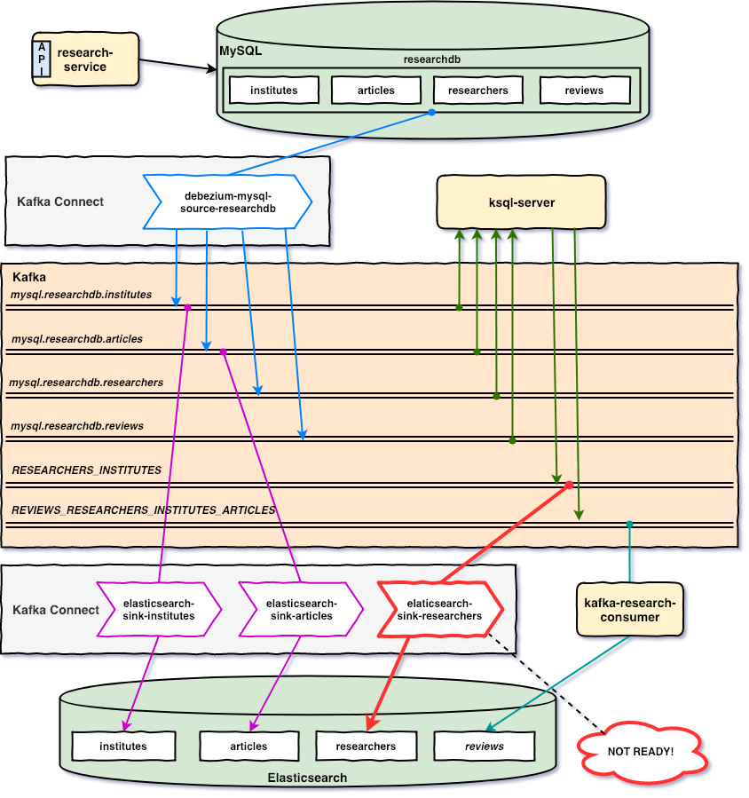
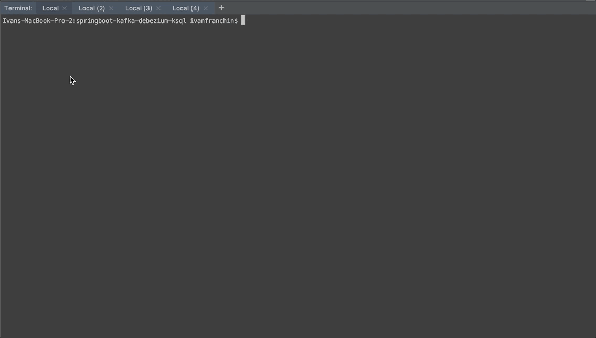

# `springboot-kafka-debezium-ksql`

The goal of this project is to play with [`Kafka`](https://kafka.apache.org), [`Debezium`](https://debezium.io/) and
[`KSQL`](https://www.confluent.io/product/ksql/). For this, we have: `research-service` that inserts/updates/deletes
records in [`MySQL`](https://www.mysql.com); `Source Connectors` that monitor change of records in MySQL and push
messages related to those changes to Kafka; `Sink Connectors` and `kafka-research-consumer` that listen messages from
Kafka and insert/update documents in [`Elasticsearch`](https://www.elastic.co); finally, `KSQL-Server` that listens
some topics in Kafka, does some joins and pushes new messages to new topics in Kafka.

## Microservices



### research-service

Monolithic Spring-Boot application that exposes a REST API to manage `Institutes`, `Articles`, `Researchers` and
`Reviews`. The data is saved in `MySQL`.

### kafka-research-consumer

Spring-boot application that listens messages from the topic `REVIEWS_RESEARCHERS_INSTITUTES_ARTICLES` (that is one of
`KSQL` outputs) and save the payload of those messages (i.e, reviews with detailed information) in `Elasticsearch`.

## Start Environment

Open a terminal and inside `springboot-kafka-debezium-ksql` root folder run the following command
```
docker-compose up -d
```
> During the first run, an image for `mysql` and `kafka-connect` will be built, whose names are
> `springboot-kafka-debezium-ksql_mysql` and `springboot-kafka-debezium-ksql_kafka-connect`, respectively.
> To rebuild those images run
> ```
> docker-compose build
> ```

Wait a little bit until all containers are `Up (healthy)`. To check the status of the containers, run
```
docker-compose ps
```

## Create connectors (3/4)

In a terminal, run the following `curl` commands to create `debezium` and 2 `elasticsearch-sink` connectors on `kafka-connect`
```
curl -i -X POST http://localhost:8083/connectors -H 'Content-Type: application/json' -d @connectors/debezium-mysql-source-researchdb.json
curl -i -X POST http://localhost:8083/connectors -H 'Content-Type: application/json' -d @connectors/elasticsearch-sink-institutes.json
curl -i -X POST http://localhost:8083/connectors -H 'Content-Type: application/json' -d @connectors/elasticsearch-sink-articles.json
```

You can check the state of the connectors and their tasks on `Kafka Connect UI` (http://localhost:8086) or calling
kafka-connect endpoint
```
curl http://localhost:8083/connectors/debezium-mysql-source-researchdb/status
curl http://localhost:8083/connectors/elasticsearch-sink-institutes/status
curl http://localhost:8083/connectors/elasticsearch-sink-articles/status
```

The state of the connectors and their tasks must be `RUNNING`. If there is any problem, you can check `kafka-connect`
container logs.
```
docker logs kafka-connect -f
```

## Run research-service

In a new terminal, run the command below inside `springboot-kafka-debezium-ksql` root folder
```
./mvnw spring-boot:run --projects research-service
```
> Note. It will create some articles, institutes and researchers. If you don't want it, just set to `false` the
> properties `load-samples.articles.enabled`, `load-samples.institutes.enabled` and `load-samples.researchers.enabled`
> in `application.yml`.

The Swagger link is http://localhost:9080/swagger-ui.html

**IMPORTANT**: create at least one `review` so that the topic `mysql.researchdb.reviews` is created on Kafka. Below
there is a request sample to create a review
```
curl -i -X POST "http://localhost:9080/api/reviews" \
  -H "accept: */*" -H "Content-Type: application/json" \
  -d "{ \"researcherId\": 1, \"articleId\": 1, \"comment\": \"Ln 56: replace the 'a' by 'an'\"}"
```

Otherwise, you will have the following exception while running `ksql-cli`
```
io.confluent.ksql.parser.exception.ParseFailedException: Exception while processing statement: Avro schema for message
values on topic mysql.researchdb.reviews does not exist in the Schema Registry.
```

## Run ksql-cli

In a new terminal, inside `springboot-kafka-debezium-ksql` root folder, run the `docker` command below to start `ksql-cli`
```
docker run -it --rm --name ksql-cli \
  --network springboot-kafka-debezium-ksql_default \
  -v $PWD/docker/ksql/researchers-institutes.ksql:/tmp/researchers-institutes.ksql \
  -v $PWD/docker/ksql/reviews-researchers-institutes-articles.ksql:/tmp/reviews-researchers-institutes-articles.ksql \
  confluentinc/cp-ksql-cli:5.2.2 http://ksql-server:8088
```

On `ksql-cli` command line, run the following commands

- Set `auto.offset.reset` value
```
SET 'auto.offset.reset' = 'earliest';
```

- Run the following script. It will create `RESEARCHERS_INSTITUTES` topic
```
RUN SCRIPT '/tmp/researchers-institutes.ksql';
```

- check whether the topic was created 
```
DESCRIBE RESEARCHERS_INSTITUTES;
SELECT * from RESEARCHERS_INSTITUTES LIMIT 5;
```

- Run the script below. It will create `REVIEWS_RESEARCHERS_INSTITUTES_ARTICLES` topic
```
RUN SCRIPT '/tmp/reviews-researchers-institutes-articles.ksql';
```

- Check whether the topic was created
```
DESCRIBE REVIEWS_RESEARCHERS_INSTITUTES_ARTICLES;
SELECT * from REVIEWS_RESEARCHERS_INSTITUTES_ARTICLES LIMIT 1;
```

## Create connectors (4/4)

In a terminal, run the `curl` command below to create `elasticsearch-sink-researchers` connector on `kafka-connect`
```
curl -i -X POST http://localhost:8083/connectors -H 'Content-Type: application/json' -d @connectors/elasticsearch-sink-researchers.json
```

You can check the state of the connector and its task on `Kafka Connect UI` (http://localhost:8086) or calling
kafka-connect endpoint
```
curl http://localhost:8083/connectors/elasticsearch-sink-researchers/status
```

## Run kafka-research-consumer

In a new terminal, run the command below inside `springboot-kafka-debezium-ksql` root folder
```
./mvnw spring-boot:run --projects kafka-research-consumer
```

## Testing

Go to the terminal where `ksql-cli` is running. On `ksql-cli` command line, run the query below
```
SELECT * from REVIEWS_RESEARCHERS_INSTITUTES_ARTICLES;
```

In another terminal, call the `research-service` simulation endpoint
```
curl -X POST "http://localhost:9080/api/simulation/reviews" \
  -H "Content-Type: application/json" \
  -d "{ \"total\": 100, \"sleep\": 500}"
```

The GIF below shows it



You can also query `Elasticsearch`
```
curl http://localhost:9200/reviews/_search?pretty
```

## Useful Links/Commands

### Kafka Topics UI

`Kafka Topics UI` can be accessed at http://localhost:8085

### Kafka Connect UI

`Kafka Connect UI` can be accessed at http://localhost:8086

### Schema Registry UI

`Schema Registry UI` can be accessed at http://localhost:8001

### Schema Registry

You can use `curl` to check the subjects in `Schema Registry`

- Get the list of subjects
```
curl http://localhost:8081/subjects
```
- Get the latest version of the subject `mysql.researchdb.researchers-value`
```
curl http://localhost:8081/subjects/mysql.researchdb.researchers-value/versions/latest
```

### Kafka Manager

`Kafka Manager` can be accessed at http://localhost:9000

**Configuration**
- First, you must create a new cluster. Click on `Cluster` (dropdown on the header) and then on `Add Cluster`
- Type on `Cluster Name` field the name of your cluster, for example: `MyZooCluster`
- On `Cluster Zookeeper Hosts` field type: `zookeeper:2181`
- Click on `Save` button on the bottom of the page. Done!

### Elasticsearch

`Elasticsearch` can be accessed at http://localhost:9200

- Get all indices
```
http://localhost:9200/_cat/indices?v
```
- Search for documents
```
http://localhost:9200/articles/_search?pretty
http://localhost:9200/institutes/_search?pretty
http://localhost:9200/researchers/_search?pretty
http://localhost:9200/reviews/_search?pretty
```

### MySQL
```
docker exec -it mysql mysql -uroot -psecret --database researchdb
SELECT a.id AS review_id, c.id AS article_id, c.title AS article_title, b.id AS reviewer_id, b.first_name, b.last_name, b.institute_id, a.comment \
  FROM reviews a, researchers b, articles c \
  WHERE a.researcher_id = b.id and a.article_id = c.id;
```

## Shutdown

Run the command below to stop and remove containers, networks and volumes
```
docker-compose down -v
```

## TODO

1. Create indices dynamically and add an `alias` for them.

2. Fix the UPPERCASE field names that `KSQL` is generating. It is possible using double-quotes but, tried and it breaks
the `CREATE STREAM`.
`Allow statement to specify the casing (camel case, uppercase, etc) for field names when serialized to output topic #1039` https://github.com/confluentinc/ksql/issues/1039

3. Replace the deprecated `topic.index.map` configured in `elasticsearch-sink-*` connectors:
Waiting for those `kafka-connect-elasticsearch` issues to be fixed:
- `Create indices before writing records #261` https://github.com/confluentinc/kafka-connect-elasticsearch/pull/261
- `ConnectException: Cannot create mapping when using RegexRouter/TimestampRouter SMT #99` https://github.com/confluentinc/kafka-connect-elasticsearch/issues/99

## References

- https://docs.confluent.io/current/ksql/docs/tutorials/basics-docker.html#ksql-quickstart-docker