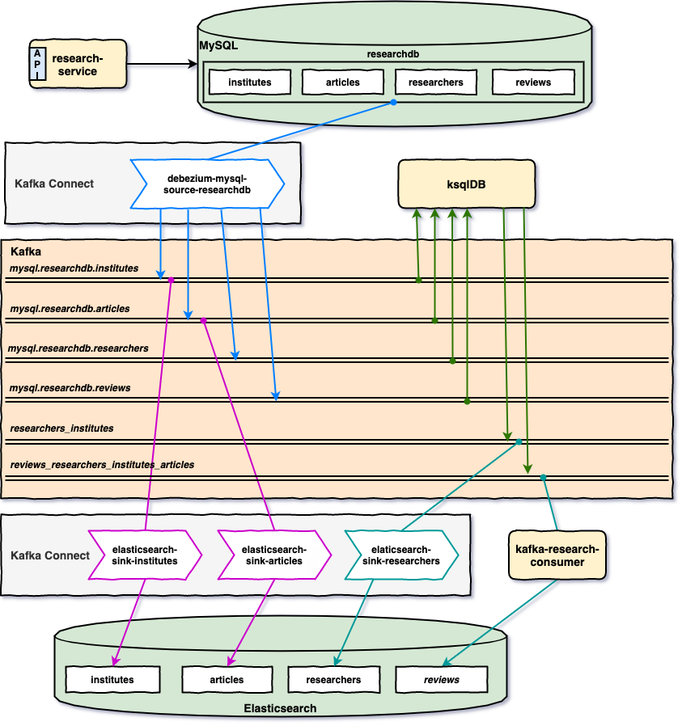
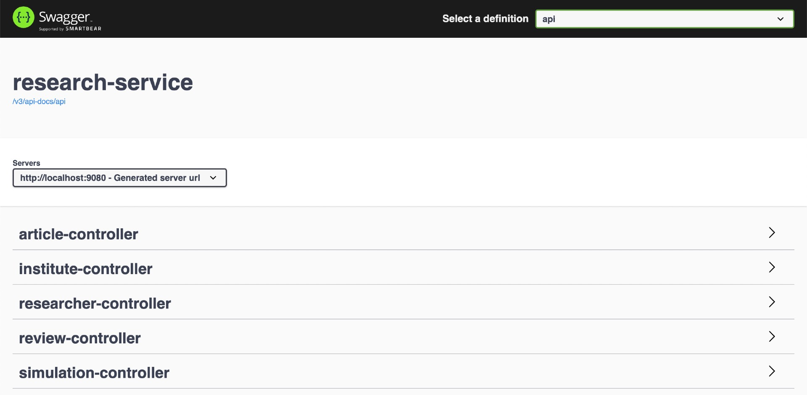

# springboot-kafka-connect-debezium-ksqldb

The goal of this project is to play with [`Kafka`](https://kafka.apache.org), [`Debezium`](https://debezium.io/) and [`ksqlDB`](https://www.confluent.io/product/ksql/). For this, we have: `research-service` that inserts/updates/deletes records in [`MySQL`](https://www.mysql.com); `Source Connectors` that monitor change of records in MySQL and push messages related to those changes to Kafka; `Sink Connectors` and `kafka-research-consumer` that listen messages from Kafka and insert/update documents in [`Elasticsearch`](https://www.elastic.co); finally, `ksqlDB-Server` that listens some topics in Kafka, does some joins and pushes new messages to new topics in Kafka.

## Proof-of-Concepts & Articles

On [ivangfr.github.io](https://ivangfr.github.io), I have compiled my Proof-of-Concepts (PoCs) and articles. You can easily search for the technology you are interested in by using the filter. Who knows, perhaps I have already implemented a PoC or written an article about what you are looking for.

## Additional Readings

- \[**Medium**\] [**Streaming MySQL changes to Elasticsearch using Kafka Connect**](https://medium.com/@ivangfr/streaming-mysql-changes-to-elasticsearch-using-kafka-connect-fe22a5d0aa27)

## Project Diagram



## Applications

- ### research-service

  Monolithic [`Spring Boot`](https://docs.spring.io/spring-boot/docs/current/reference/htmlsingle/) application that exposes a REST API to manage `Institutes`, `Articles`, `Researchers` and `Reviews`. The data is saved in `MySQL`.
  
  

- ### kafka-research-consumer

  `Spring Boot` application that listens messages from the topic `reviews_researchers_institutes_articles` (that is one of `ksqlDB` outputs) and save the payload of those messages (i.e, reviews with detailed information) in `Elasticsearch`.

## Prerequisites

- [`Java 17+`](https://www.oracle.com/java/technologies/downloads/#java17)
- [`Docker`](https://www.docker.com/)

## Start Environment

- Open a terminal and, inside `springboot-kafka-connect-debezium-ksqldb` root folder, run the following command
  ```
  docker compose up -d
  ```
  > **Note**: During the first run, an image for `mysql` and `kafka-connect` will be built, whose names are `springboot-kafka-connect-debezium-ksqldb_mysql` and `springboot-kafka-connect-debezium-ksqldb_kafka-connect`, respectively. To rebuild those images run
  > ```
  > docker compose build
  > ```

- Wait for all Docker containers to be up and running. To check it, run
  ```
  docker compose ps
  ```
  
## Create Kafka Topics

In order to have topics in `Kafka` with more than `1` partition, we must create them manually and not wait for the connectors to create for us. So, for it

- In a terminal, make sure you are in `springboot-kafka-connect-debezium-ksqldb` root folder

- Run the script below
  ```
  ./create-kafka-topics.sh
  ```

  It will create the topics `mysql.researchdb.institutes`, `mysql.researchdb.researchers`, `mysql.researchdb.articles` and `mysql.researchdb.reviews` with `5` partitions.

## Create connectors (3/4)

- In a terminal, make sure you are in `springboot-kafka-connect-debezium-ksqldb` root folder

- Run the following `curl` commands to create one `Debezium` and two `Elasticsearch-Sink` connectors in `kafka-connect`
  ```
  curl -i -X POST localhost:8083/connectors -H 'Content-Type: application/json' -d @connectors/debezium-mysql-source-researchdb.json
  curl -i -X POST localhost:8083/connectors -H 'Content-Type: application/json' -d @connectors/elasticsearch-sink-institutes.json
  curl -i -X POST localhost:8083/connectors -H 'Content-Type: application/json' -d @connectors/elasticsearch-sink-articles.json
  ```

- You can check the state of the connectors and their tasks on `Kafka Connect UI` (http://localhost:8086) or calling `kafka-connect` endpoint
  ```
  curl localhost:8083/connectors/debezium-mysql-source-researchdb/status
  curl localhost:8083/connectors/elasticsearch-sink-institutes/status
  curl localhost:8083/connectors/elasticsearch-sink-articles/status
  ```

- The state of the connectors and their tasks must be `RUNNING`. If there is any problem, you can check `kafka-connect` container logs.
  ```
  docker logs kafka-connect
  ```

## Run research-service

- Open a new terminal and navigate to `springboot-kafka-connect-debezium-ksqldb` root folder

- Run the command below to start the application
  ```
  ./mvnw clean spring-boot:run --projects research-service -Dspring-boot.run.jvmArguments="-Dserver.port=9080"
  ```
  It will create some articles, institutes and researchers. If you don't want it, just set to `false` the properties `load-samples.articles.enabled`, `load-samples.institutes.enabled` and `load-samples.researchers.enabled` in `application.yml`.

- The Swagger link is http://localhost:9080/swagger-ui.html

- **Important**: create at least one `review` so that `mysql.researchdb.reviews-key` and `mysql.researchdb.reviews-value` are created in `Schema Registry`. Below there is a sample request to create a review.
  ```
  curl -i -X POST localhost:9080/api/reviews \
    -H "Content-Type: application/json" \
    -d "{ \"researcherId\": 1, \"articleId\": 1, \"comment\": \"Ln 56: replace the 'a' by 'an'\"}"
  ```

## Run ksqlDB-cli

- Open a new terminal and, inside `springboot-kafka-connect-debezium-ksqldb` root folder, run the `docker` command below to start `ksqlDB-cli`
  ```
  docker run -it --rm --name ksqldb-cli \
    --network springboot-kafka-connect-debezium-ksqldb_default \
    -v $PWD/docker/ksql/researchers-institutes.ksql:/tmp/researchers-institutes.ksql \
    -v $PWD/docker/ksql/reviews-researchers-institutes-articles.ksql:/tmp/reviews-researchers-institutes-articles.ksql \
    confluentinc/cp-ksqldb-cli:7.4.1 http://ksqldb-server:8088
  ```

- On `ksqlDB-cli` command line, run the following commands

  - Set `auto.offset.reset` value
    ```
    SET 'auto.offset.reset' = 'earliest';
    ```
  
  - Run the following script. It will create `researchers_institutes` topic
    ```
    RUN SCRIPT '/tmp/researchers-institutes.ksql';
    ```
  
  - Check whether the topic was created 
    ```
    DESCRIBE "researchers_institutes";
    SELECT * FROM "researchers_institutes" EMIT CHANGES LIMIT 5;
    ```
  
  - Run the script below. It will create `reviews_researchers_institutes_articles` topic
    ```
    RUN SCRIPT '/tmp/reviews-researchers-institutes-articles.ksql';
    ```
  
  - Check whether the topic was created
    ```
    DESCRIBE "reviews_researchers_institutes_articles";
    SELECT * FROM "reviews_researchers_institutes_articles" EMIT CHANGES LIMIT 1;
    ```

## Create connectors (4/4)

- In a terminal, make sure you are in `springboot-kafka-connect-debezium-ksqldb` root folder

- Run the `curl` command below to create `elasticsearch-sink-researchers` connector in `kafka-connect`
  ```
  curl -i -X POST localhost:8083/connectors -H 'Content-Type: application/json' -d @connectors/elasticsearch-sink-researchers.json
  ```

- You can check the state of the connector and its task on `Kafka Connect UI` (http://localhost:8086) or calling `kafka-connect` endpoint
  ```
  curl localhost:8083/connectors/elasticsearch-sink-researchers/status
  ```

## Run kafka-research-consumer

- Open a new terminal and navigate to `springboot-kafka-connect-debezium-ksqldb` root folder

- Run the command below to start the application
  ```
  ./mvnw clean spring-boot:run --projects kafka-research-consumer -Dspring-boot.run.jvmArguments="-Dserver.port=9081"
  ```
  > The command below generates the Java class `ReviewMessage` from Avro file present in `src/main/resources/avro`
  > ```
  > ./mvnw generate-sources --projects kafka-research-consumer
  > ```

- This service runs on port `9081`. The `health` endpoint is http://localhost:9081/actuator/health

- \[Optional\] We can start another `kafka-research-consumer` instance by opening another terminal and running
  ```
  ./mvnw clean spring-boot:run --projects kafka-research-consumer -Dspring-boot.run.jvmArguments="-Dserver.port=9082"
  ```

## Testing

- Go to the terminal where `ksql-cli` is running
  
- On `ksql-cli` command line, run the following query
  ```
  SELECT * FROM "reviews_researchers_institutes_articles" EMIT CHANGES;
  ```

- In another terminal, call the `research-service` simulation endpoint
  ```
  curl -X POST localhost:9080/api/simulation/reviews \
    -H "Content-Type: application/json" \
    -d "{\"total\": 100, \"sleep\": 100}"
  ```

- The GIF below shows it. `research-service` is running in the upper left terminal; `kafka-research-consumer` is running in the upper right terminal; the middle terminal is used to submit the POST request to `research-service`. The lower terminal is where `ksql-cli` is running. 

  

- You can also query `Elasticsearch`
  ```
  curl "localhost:9200/reviews/_search?pretty"
  ```

## Useful Links/Commands

- **Kafka Topics UI**

  `Kafka Topics UI` can be accessed at http://localhost:8085

- **Kafka Connect UI**

  `Kafka Connect UI` can be accessed at http://localhost:8086

- **Schema Registry UI**

  `Schema Registry UI` can be accessed at http://localhost:8001

- **Schema Registry**

  You can use `curl` to check the subjects in `Schema Registry`

  - Get the list of subjects
    ```
    curl localhost:8081/subjects
    ```
  - Get the latest version of the subject `mysql.researchdb.researchers-value`
    ```
    curl localhost:8081/subjects/mysql.researchdb.researchers-value/versions/latest
    ```

- **Kafka Manager**

  `Kafka Manager` can be accessed at http://localhost:9000

  _Configuration_
  - First, you must create a new cluster. Click on `Cluster` (dropdown on the header) and then on `Add Cluster`
  - Type the name of your cluster in `Cluster Name` field, for example: `MyCluster`
  - Type `zookeeper:2181` in `Cluster Zookeeper Hosts` field
  - Enable checkbox `Poll consumer information (Not recommended for large # of consumers if ZK is used for offsets tracking on older Kafka versions)`
  - Click on `Save` button at the bottom of the page.

- **Elasticsearch**

  `Elasticsearch` can be accessed at http://localhost:9200

  - Get all indices
    ```
    curl "localhost:9200/_cat/indices?v"
    ```
  - Search for documents
    ```
    curl "localhost:9200/articles/_search?pretty"
    curl "localhost:9200/institutes/_search?pretty"
    curl "localhost:9200/researchers/_search?pretty"
    curl "localhost:9200/reviews/_search?pretty"
    ```

- **MySQL**

  - Access `MySQL monitor`
    ```
    docker exec -it -e MYSQL_PWD=secret mysql mysql -uroot --database researchdb
    ```

  - Inside the monitor, run the following `SELECT` command
    ```
    SELECT a.id AS review_id, c.id AS article_id, c.title AS article_title, b.id AS reviewer_id, b.first_name, b.last_name, b.institute_id, a.comment \
    FROM reviews a, researchers b, articles c \
    WHERE a.researcher_id = b.id and a.article_id = c.id;
    ```
  > Type `exit` to leave `MySQL` terminal

## Shutdown

- Go to the terminals where `research-service` and `kafka-research-consumer` are running and press `Ctrl+C` to stop them
- Go to the terminal where `ksql-cli` is running and press `Ctrl+C` to stop the `SELECT`; then, type `exit`
- To stop and remove docker compose containers, network and volumes, go to a terminal and, inside `springboot-kafka-connect-debezium-ksqldb` root folder, run the command below
  ```
  docker compose down -v
  ```

## Cleanup

To remove the Docker images created by this project, go to a terminal and, inside `springboot-kafka-connect-debezium-ksqldb` root folder, run the following script
```
./remove-docker-images.sh
```

## TODO

- Create ES indices dynamically and add an `alias` for them.

## References

- https://docs.confluent.io/platform/current/ksqldb/index.html
